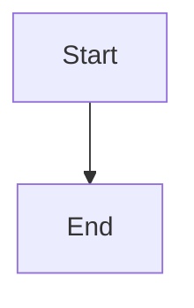

# SUSE Demo AWS - Architecture Diagrams

This directory contains architecture diagrams and screenshots for the SUSE Demo AWS infrastructure.

## Mermaid Diagrams

### architecture.mmd
Complete infrastructure architecture showing:
- AWS VPC and networking layout
- All four modules (shared-services, rancher-manager, observability, security)
- Terraform state dependencies
- DNS configuration (Route53)
- Certificate management (Let's Encrypt)
- Security groups and network flow
- External integrations (SUSE SCC, Let's Encrypt)

### deployment-flow.mmd
Deployment workflow diagram showing:
- Step-by-step deployment process
- Decision points (Route53, Let's Encrypt)
- Resource creation flow
- Post-installation steps
- Destruction workflow (reverse order)

## Viewing Mermaid Diagrams

### Option 1: GitHub (Recommended)
GitHub natively renders Mermaid diagrams. Just view the .mmd files directly on GitHub.

### Option 2: VS Code
Install the "Mermaid Preview" extension:
1. Open VS Code
2. Install extension: `bierner.markdown-mermaid`
3. Open any .mmd file
4. Right-click → "Open Preview"

### Option 3: Online Mermaid Editor
Copy the diagram content to: https://mermaid.live/

### Option 4: Command Line
Install mermaid-cli:
```bash
npm install -g @mermaid-js/mermaid-cli

# Generate PNG
mmdc -i architecture.mmd -o architecture.png

# Generate SVG
mmdc -i deployment-flow.mmd -o deployment-flow.svg
```

## Screenshots

- **SUSE-Rancher-Dashboard.png** - Rancher Manager UI screenshot
- **SUSE-Observability-Dashboard.png** - SUSE Observability UI screenshot
- **SUSE-Security-Dashbard.png** - NeuVector Security UI screenshot
- **cost-estimate-spreadsheet-10-09.png** - AWS cost estimate breakdown

## Embedding in Documentation

To embed these diagrams in markdown files:

````markdown

````

Or reference the .mmd files:
```markdown

```

## Diagram Updates

These diagrams are version-controlled alongside the code. When infrastructure changes:
1. Update the corresponding .mmd file
2. Commit with your infrastructure changes
3. Diagrams stay in sync with actual deployment

## Color Legend

### Architecture Diagram
- **Orange**: Foundation layer (shared-services)
- **Blue**: Product modules (rancher, observability, security)
- **Green**: Kubernetes clusters
- **Red**: Security components
- **Purple**: External services

### Deployment Flow Diagram
- **Green**: Start/End points
- **Orange**: Decision points
- **Blue**: Deployment processes
- **Purple**: Resources created
- **Red**: Destruction flow
