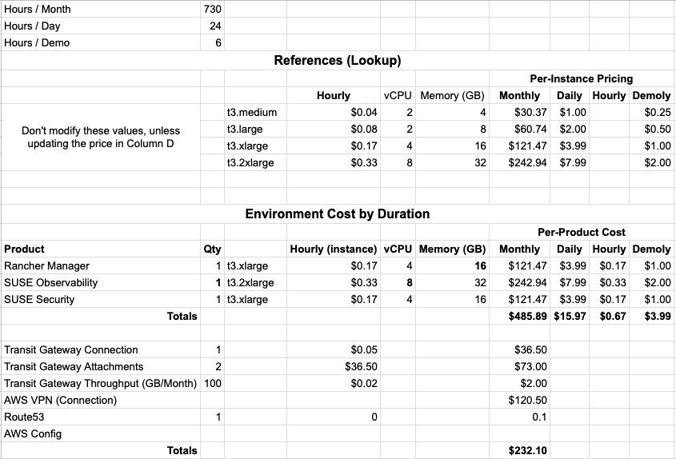

# SUSE Demo Environment - AWS

## Purpose
This repository contains Terraform projects to deploy a SUSE demo environment with a number of products running in AWS.  The terraform code here will deploy the core product with fundamental configuration needed.  After that, the demo requires some interactive updates via the WebUI or Kubernetes API.

This demo will have a cost associated with it - as it runs in AWS and I have opted to use SLES.  
I  have published some cost estimates (with AWS Calculator output).  

## Status
This is very much still a work-in-progress at this time (2025 October) but overall should be functional.  

| Project                  | Status |
|:-------------------------|:------:|
| Shared Services          | Done   | 
| **SUSE Rancher Manager** | Done   |
| **SUSE Observability**   | Done   |
| **SUSE Security**        | Done (mostly) | 

## Products Included or Utilized

- **SUSE Rancher Manager** - Kubernetes management platform
- **SUSE Observability** - Monitoring and observability solution
- **SUSE Security** - Security and compliance tools
- **Let's Encrypt** - Certificate Vendor

## Architecture

The demo environment is organized into separate Terraform projects:

- **shared-services/** - Common infrastructure (VPC, networking, security groups, etc.)
- **rancher-manager/** - SUSE Rancher Manager deployment
- **observability/** - SUSE Observability deployment
- **security/** - SUSE Security deployment

## Prerequisites

- SUSE Customer Center login and registration for SLES Hosts
- AWS CLI configured with appropriate credentials
- A Top-Level Domain (TLD) hosted by AWS using route53 that you own/manage, and have a permissions to modify records with the IAM principal you utilze.
- Terraform >= 1.5.0

During the deployment you will need to obtain or create
- SSH key pair for EC2 instances
- HostedZoneId for your TLD

## Notes and Caveats

* This is NOT completely automated.  You will need to proceed with some click-ops, etc.. to connect the different products (i.e. add Rancher Manager to the Observability platform using kubectl/helm).  This is intentional to allow some insight in to how these independent products work together.
* I have intentionally left some of my own (opinionated) values in some of the variables - specifically my own domain_name.  I feel it makes it easier to understand how the variable values are used.  You MUST, however, update with your own values.
* I have created a sub-domain for this demo (suse-demo-aws.kubernerdes.com) and an IAM principal with the appropriate permissions that allows me to create records in that domain.  This is somewhat unique to my own situation as my top-level domain (kubernerdes.com) is owned/managed by another AWS account.  I have delegated this demo domain using [Route53 Multi-Account Delegation](https://github.com/cloudxabide/route53_multi_account_delegation) which is not an official process, but certainly works.
* Everything is in a public subnet (NATGW is not needed).
* While there is a separate directory for each SUSE product, they all rely on the tftstate file in the shared-services directory.  Therefore, do not modify the "shared-services" once it has been deployed, and remove that infrastructure last.
* Similar to the state-file I just mentioned, there is a single terraform.tfvars file in the root/base directory which requires you to reference it when running terraforms commands.  I am not positive this was teh best approach, but it was the best I could create given the other project design considerations I imposed on myself.

**NOTE:** This is ONLY intended to run as a demo/lab. Trade-offs have been made to minimize cost which make this approach unacceptable for production use-cases.

## democtl
Cut right to the chase...

Demo Control / Demo Cuddle / Demo [Cuttle Fish?](https://en.wikipedia.org/wiki/Cuttlefish)... anyhow...
I create Scripts/democtl to manage this demo in a more automated way.  I am mentioning this down here, ALL the way at the bottom, because I think you should do the deployment manually a few times to see what is actually happening.  **Then**... knock yerself out with the cuttle command.

Sync this this repo and cd in to it, update terraform.tfvars, then have some fun:
```
EXAMPLES:
    # Deploy infrastructure
    Scripts/democtl build

    # Display terraform outputs
    Scripts/democtl output

    # Retrieve kubeconfig files
    Scripts/democtl getkube

    # Destroy infrastructure
    Scripts/democtl destroy

    # Show help
    Scripts/democtl help
```

If you are more interested in some manual steps, continue reading...

## Deployment Order

Deploy projects in the following order to ensure dependencies are met:

1. **Shared Services** - Deploy first to create common infrastructure
2. **SUSE Rancher Manager** - Deploy Rancher for Kubernetes management
3. **SUSE Observability** - Deploy monitoring stack
4. **SUSE Security** - Deploy security components

## Quick Start

### 1. Download Repo and Configure Variables

Edit the root `terraform.tfvars` file with your settings:
```bash
mkdir -p ~/Developer/Projects; cd $_
# Archive existing demo directory
[ -d "suse-demo-aws" ] && { i=1; while [ -d "suse-demo-aws-$(printf '%02d' $i)" ]; do ((i++)); done; mv suse-demo-aws "suse-demo-aws-$(printf '%02d' $i)"; }
git clone https://github.com/jradtke-suse/suse-demo-aws.git; cd suse-demo-aws
cp ../terraform.tfvars.example terraform.tfvars # I store a "hydrated configuraiton" that has all the values populated
vi terraform.tfvars
```

Update key values (examples here):
- `owner` - Your name/identifier
- `ssh_public_key` - Your SSH public key
- `suse_email` and `suse_regcode` - SUSE subscription details
- `allowed_ssh_cidr_blocks` and `allowed_web_cidr_blocks` - Your IP for security
- Instance types and sizes (if different from defaults)

### 2. Deploy Shared Services

```bash
cd shared-services
terraform init
terraform plan -var-file=../terraform.tfvars
terraform apply -var-file=../terraform.tfvars
cd -
```

### 3. Deploy SUSE Rancher Manager

```bash
cd ../rancher-manager
terraform init
terraform plan -var-file=../terraform.tfvars
terraform apply -var-file=../terraform.tfvars
cd -
```

### 4. Deploy SUSE Observability

```bash
cd ../observability
terraform init
terraform plan -var-file=../terraform.tfvars
terraform apply -var-file=../terraform.tfvars
cd -
```

### 5. Deploy SUSE Security

```bash
cd ../security
terraform init
terraform plan -var-file=../terraform.tfvars
terraform apply -var-file=../terraform.tfvars
cd -
```

## Configuration

**NEW:** All projects now share a single unified `terraform.tfvars` file at the repository root. This simplifies configuration management and ensures consistency across all modules.

### Key Changes
- **Single Configuration File:** Edit `terraform.tfvars` at the root for all modules
- **Module-Specific Variables:** Instance types and volumes are now prefixed:
  - `rancher_instance_type`, `rancher_root_volume_size`
  - `observability_instance_type`, `observability_root_volume_size`
  - `security_instance_type`, `security_root_volume_size`
- **Common Variables:** Shared variables defined in `common-vars.tf` (symlinked into each module)

### Usage
When running Terraform commands, reference the root configuration file:

```bash
cd shared-services
terraform init
terraform plan -var-file=../terraform.tfvars
terraform apply -var-file=../terraform.tfvars
```

Apply the same pattern for all modules (rancher-manager, observability, security).

## Cleanup

To destroy all resources, run `terraform destroy` in reverse order:

**Important:** Destroy in reverse order to respect state dependencies. You must type "yes" and hit enter for each module.

Also, if you do not see/recognize the risk in the following commands, I'd probably just run them manually ;-)  (hint: you shouldn't *really* echo "yes" to a command, let alone a command with "destroy" in it.  - you've been warned)

```bash
cd security && echo "yes" | terraform destroy -var-file=../terraform.tfvars; cd ..
cd observability && echo "yes" | terraform destroy -var-file=../terraform.tfvars; cd ..
cd rancher-manager && echo "yes" | terraform destroy -var-file=../terraform.tfvars;  cd ..
cd shared-services && echo "yes" | terraform destroy -var-file=../terraform.tfvars; cd ..
```

## Cost Estimates

This section is a work-in-progress and I will update as I learn more.  
You can *always* utilize: [AWS Calculator](https://calculator.aws/) or [Vantage](https://instances.vantage.sh/) 



